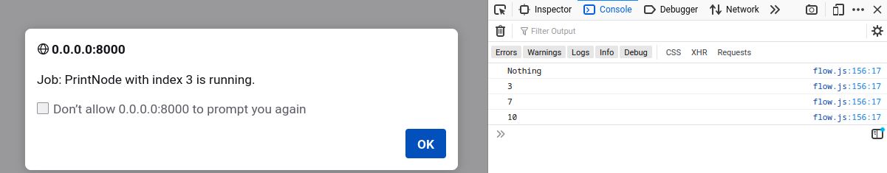

# Running the Example

```sh
$ wasm-pack build --target web
$ python3 -m http.server
```

Open the browser at [http://0.0.0.0:8000/](http://0.0.0.0:8000/).

Step through the flow:



# Executing Tests

All Rust internal test can be executed using:

```sh
$ cargo test
```

while tests that require WASM can be executing using:

```sh
$ wasm-pack test --node
```
